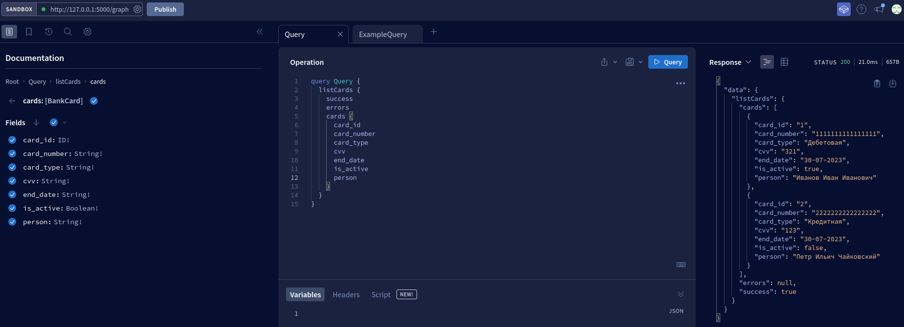
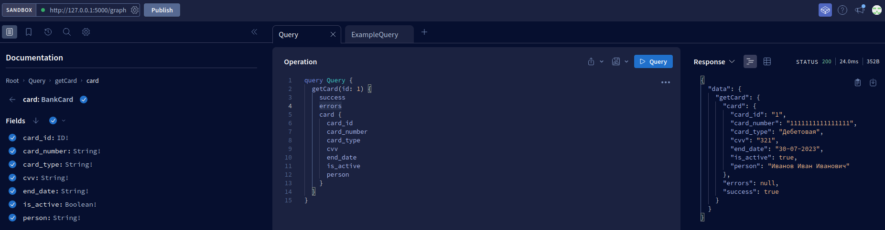
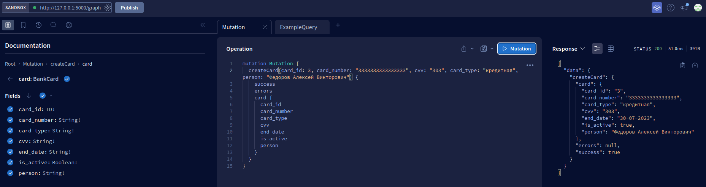
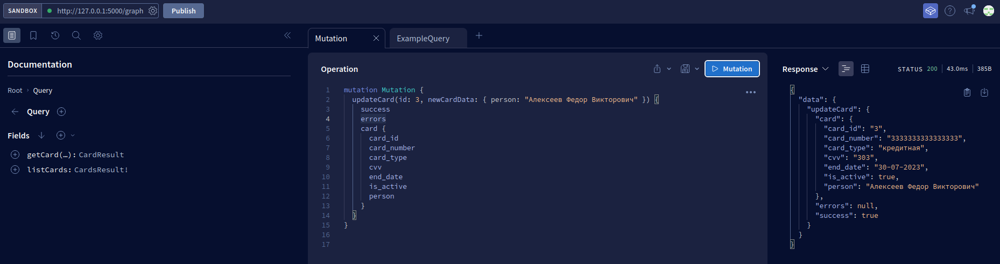
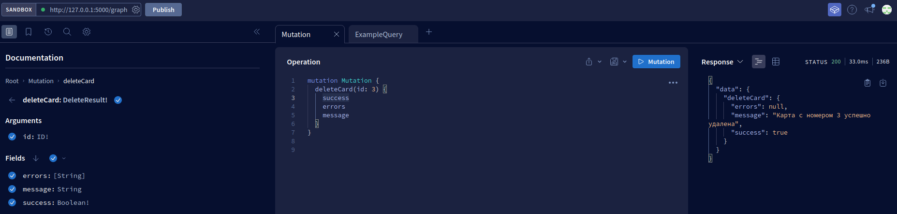

# 
Практическое задание №1.

**
Тема: «GraphQL schema-first»
**

**Суть работы:** реализовать api на основе GraphQL с использованием библиотеки ariadne.

**Ход работы:**

1. Выберите для работы любую интересную вам тематику, аналогично примеру с занятий про машины.
2. По аналогии с реализацией на занятиях написать свою программу, с query (получение списка объектов, получение одного объекта) и mutation (добавление, редактирование и удаление объекта).
3. Должно быть подключение к базе данных, и все манипуляции с объектами совершаются в ней.
4. Проверить работоспособность с помощью https://studio.apollographql.com/sandbox/explorer.

Результатом работы будет программный код и файл со скриншотами результатов запросов.

**Результаты работы:**

1. Создана таблица BankCard в базе данных postgresql;
2. Подключена база данных к приложению;
3. Реализованы:
***
- Получение списка элементов:

- Получение одного объекта по id:

- Добавление объекта:

- Редактирование объекта:

- Удаление объекта:

